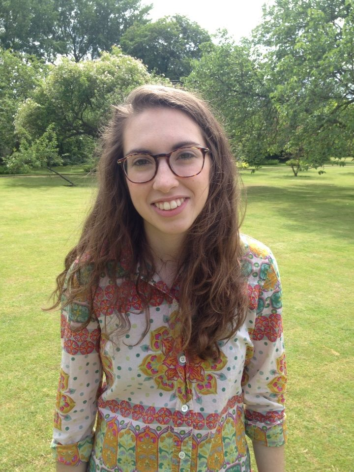

<HEAD>
<!-- Global site tag (gtag.js) - Google Analytics -->
  
  
</HEAD>

  

      <ul class="nav">
          <li><a href="{{ BASE_PATH }}/assets/fink_cv.pdf" target="_blank">CV</a></li>
          <li><a href="https://www.linkedin.com/in/lauren-fink-2ba747109/" target="_blank">LinkedIn</a></li>
          <li><a href="https://github.com/lkfink" target="_blank">Github</a></li>
      </ul>
  

I am a postdoctoral researcher at the [Max Planck Institute for Empirical Aesthetics](https://www.aesthetics.mpg.de/institut.html){:target="_blank"} in Frankfurt am Main, Germany. I use a combination of methods, namely, computational modeling, psychophysics, physiological recording, eye-tracking, and self-reports, to answer questions about how music affects human perception, attention, and inter-personal synchrony. At the moment, my research interests are centered around using physiological data (e.g. eye-tracking, EEG) to:
-	predict listeners’ subjective evaluation or experience of music
-	inform computational models of how we process events and generate expectations in time
-	decode what someone is listening to  

I hold a PhD in neuroscience from the [University of California, Davis](https://www.ucdavis.edu/){:target="_blank"}, supervised by [Dr. Petr Janata](https://atonal.ucdavis.edu/){:target="_blank"}. Previously, I attended the [University of Cincinnati College&ndash;Conservatory of Music](https://ccm.uc.edu/){:target="_blank"} and studied with [Allen Otte](http://ccm.uc.edu/about/directory.html?eid=otteac&thecomp=uceprof){:target="_blank"} of the [Percussion Group Cincinnati](http://www.pgcinfo.com/PGC.html){:target="_blank"}, earning a Bachelors of Music in percussion performance. I also hold an M.Phil. from the [University of Cambridge](https://www.cam.ac.uk/){:target="_blank"}, where I worked at the [Center for Music & Science](http://cms.mus.cam.ac.uk/){:target="_blank"}, supervised by [Dr. Ian Cross](http://www.mus.cam.ac.uk/directory/ian-cross){:target="_blank"}. Additionally, I have been a visiting researcher at the [Swartz Center for Computational Neuroscience](https://sccn.ucsd.edu/){:target="_blank"} and the Stanford University [Center for Computer Research in Music and Acoustics](https://ccrma.stanford.edu/){:target="_blank"}. 

<!-- She was the scientific co-chair of a [Conference on Music and Eye-Tracking](https://www.aesthetics.mpg.de/institut/veranstaltungen/music-eye-tracking-conference-2017.html){:target="_blank"} and a guest editor of a [Special Issue](https://bop.unibe.ch/JEMR/issue/view/793){:target="_blank"} on the same topic for the Journal of Eye Movement Research.  --> 

[curriculum vitae ]({{ BASE_PATH }}/assets/fink_cv.pdf){:target="_blank"} 

---

<h4>Contact</h4>

    

        

            Lauren Fink 
            <a href="https://www.ae.mpg.de/" target="_blank">Max Planck Institute for Empirical Aesthetics</a> 
            Frankfurt am Main, Germany   

            

            <a href="https://www.linkedin.com/in/lauren-fink-2ba747109/" target="_blank">LinkedIn</a> 
            Email: <code>lauren.</code><b>I</b><code>fink</code><b>don't</b><code>@</code><b>want</b><code>ae</code><b>spam!
            </b><code>.</code><b>So</b><code>mpg</code><b>please</b><code>.</code><b>leave
            </b><code>d</code><b>me</b><code>e</code> 
            <a href="https://orcid.org/0000-0001-6699-750X" target="orcid.widget" rel="noopener noreferrer" style="vertical-align:top;">    orcid.org/0000-0001-6699-750X</a> 
            <a href= "https://scholar.google.com/citations?view_op=list_works&hl=en&user=-6H65F4AAAAJ" target="_blank">Google Scholar</a>
            

            
        

        

        
        

    

